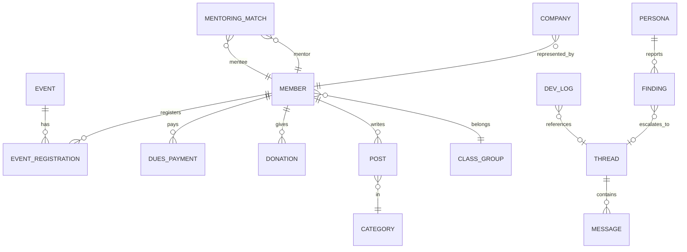

## 0. 원칙
- **단일 출처**: 이 문서가 스키마의 기준이다. 코드(`functions/`)와 데이터 파일(`/data/*.json`)은 이 문서를 따른다.
- **P1**은 파일 기반(JSON) + D1(토론)이다. **P2**부터 공지·행사·임원을 D1로, **P3**부터 회원을 D1로 이관한다.
- 식별자는 정수 자동증가(D1) 또는 파일 내 `id`. 시각은 ISO 8601(UTC) 문자열. 날짜는 `YYYY-MM-DD`.
- 개인정보(회원)는 최소 수집·공개범위 자기결정·암호화 저장을 원칙으로 한다.

## 1. 개체-관계 다이어그램 (목표 스키마)



## 2. P1 데이터 (파일 기반, `/public/data/`)

### 2.1 `notices.json` — 소식 (공지·동문회 소식·경조사·언론)
| 필드 | 타입 | 필수 | 설명 |
|---|---|---|---|
| id | int | ✔ | 고유 번호 |
| type | enum | ✔ | `notice` 공지 · `news` 동문회 소식 · `family` 경조사 · `press` 언론 |
| cat | string | ✔ | 화면 표기용 분류 (공지/안내/모집/소식/경조/언론) |
| title | string | ✔ | 제목 |
| date | date | ✔ | 게시일 |
| pinned | bool | | 상단 고정 |
| body | string | | 본문 (개행 유지) |

### 2.2 `events.json` — 행사
| 필드 | 타입 | 필수 | 설명 |
|---|---|---|---|
| id | int | ✔ | |
| title | string | ✔ | |
| date / time | date / HH:MM | ✔ | |
| place | string | ✔ | |
| kind | string | ✔ | 총회·홈커밍·친목·장학·포럼·멘토링 |
| status | enum | ✔ | `open` 접수중 · `soon` 준비중 · `plan` 계획 · `closed` 종료 |
| desc | string | | 한 줄 설명 |

### 2.3 `officers.json` — 임원 · 위원회
`term`(임기 표기), `groups[]{role, people[]{name, cls, org}}`, `committees[]{name, desc}`. 현재 자리표시자(미정) 상태 — **TODO-003**.

### 2.4 `companies.json` — 동문 기업
`items[]{name, industry, ceo, url}`.

### 2.5 `plan.json` — 마스터플랜 단계
`current`, `phases[]{id, goal, scope, status(done|wip|todo|hold), when}`.

### 2.6 `history.json` — 개발이력
| 필드 | 타입 | 설명 |
|---|---|---|
| id | string | `L-0001` 형식 |
| ts | datetime | 기록 시각 (KST 표기) |
| kind | enum | `plan` 계획 · `build` 구현 · `fix` 수정 · `deploy` 배포 · `decision` 결정 · `inspect` 점검 · `discuss` 토론 반영 · `todo` 할 일 |
| title | string | 한 줄 요약 |
| detail | string | 상세 (선택) |
| files | string[] | 변경 파일 (선택) |
| ref | string | 관련 토론/점검 ID (선택) |

### 2.7 `personas.json` — 자율점검 페르소나
`items[]{id, name, initial, age, cls, role, device, goals[], pain[]}`.

### 2.8 `inspections.json` — 자율점검 결과
| 필드 | 타입 | 설명 |
|---|---|---|
| runs[] | | `{id, ts, build, summary, scenarios: n, pass: n}` |
| findings[] | | `{id, run, persona, sev(P1|P2|P3), page, title, detail, action(fixed|escalated|open|wontfix), status, ref}` |

## 3. D1 스키마 (P1: 토론 / P2~: 확장)

```sql
-- P1 · 개발자토론
CREATE TABLE IF NOT EXISTS threads (
  id INTEGER PRIMARY KEY AUTOINCREMENT,
  title TEXT NOT NULL,
  author TEXT NOT NULL,           -- 작성자 표시명
  kind TEXT NOT NULL DEFAULT 'question',  -- question | request | idea | issue | inspection
  status TEXT NOT NULL DEFAULT 'open',    -- open | answered | resolved | wontfix
  created_at TEXT NOT NULL DEFAULT (strftime('%Y-%m-%dT%H:%M:%fZ','now')),
  updated_at TEXT NOT NULL DEFAULT (strftime('%Y-%m-%dT%H:%M:%fZ','now'))
);
CREATE TABLE IF NOT EXISTS messages (
  id INTEGER PRIMARY KEY AUTOINCREMENT,
  thread_id INTEGER NOT NULL REFERENCES threads(id) ON DELETE CASCADE,
  author TEXT NOT NULL,
  role TEXT NOT NULL DEFAULT 'user',      -- user | agent | persona | system
  body TEXT NOT NULL,
  created_at TEXT NOT NULL DEFAULT (strftime('%Y-%m-%dT%H:%M:%fZ','now'))
);
CREATE INDEX IF NOT EXISTS idx_messages_thread ON messages(thread_id, created_at);

-- P2 · 콘텐츠 (예정)
CREATE TABLE IF NOT EXISTS posts (
  id INTEGER PRIMARY KEY AUTOINCREMENT,
  type TEXT NOT NULL,            -- notice | news | family | press
  cat TEXT, title TEXT NOT NULL, body TEXT, date TEXT NOT NULL,
  pinned INTEGER NOT NULL DEFAULT 0, published INTEGER NOT NULL DEFAULT 1,
  created_at TEXT, updated_at TEXT
);
CREATE TABLE IF NOT EXISTS events (
  id INTEGER PRIMARY KEY AUTOINCREMENT,
  title TEXT NOT NULL, date TEXT NOT NULL, time TEXT, place TEXT, kind TEXT,
  status TEXT NOT NULL DEFAULT 'soon', desc TEXT, capacity INTEGER, fee INTEGER,
  created_at TEXT, updated_at TEXT
);

-- P3 · 회원 (예정 · 개인정보)
CREATE TABLE IF NOT EXISTS members (
  id INTEGER PRIMARY KEY AUTOINCREMENT,
  email TEXT UNIQUE NOT NULL, name TEXT NOT NULL,
  program TEXT NOT NULL,         -- UG | MS | PHD | MBA | EMBA | AMP
  entry_year INTEGER, grad_year INTEGER, cohort TEXT,   -- 학번 · 졸업연도 · 기수
  company TEXT, title TEXT, industry TEXT, phone TEXT,
  visibility TEXT NOT NULL DEFAULT 'members',           -- public | members | private
  verified INTEGER NOT NULL DEFAULT 0, verified_at TEXT, verified_by TEXT,
  role TEXT NOT NULL DEFAULT 'member',                  -- member | officer | staff | admin
  created_at TEXT, updated_at TEXT
);
CREATE TABLE IF NOT EXISTS class_groups ( id INTEGER PRIMARY KEY, label TEXT, program TEXT, entry_year INTEGER, president_member_id INTEGER, note TEXT );

-- P4 · 신청 · 결제 (예정)
CREATE TABLE IF NOT EXISTS event_registrations ( id INTEGER PRIMARY KEY AUTOINCREMENT, event_id INTEGER, member_id INTEGER, guests INTEGER DEFAULT 0, status TEXT DEFAULT 'registered', created_at TEXT );
CREATE TABLE IF NOT EXISTS dues_payments ( id INTEGER PRIMARY KEY AUTOINCREMENT, member_id INTEGER, kind TEXT, amount INTEGER, year INTEGER, method TEXT, pg_ref TEXT, paid_at TEXT );
CREATE TABLE IF NOT EXISTS donations ( id INTEGER PRIMARY KEY AUTOINCREMENT, member_id INTEGER, purpose TEXT, amount INTEGER, recurring INTEGER DEFAULT 0, receipt_requested INTEGER DEFAULT 0, pg_ref TEXT, paid_at TEXT );

-- P5 · 커뮤니티 (예정)
CREATE TABLE IF NOT EXISTS companies ( id INTEGER PRIMARY KEY AUTOINCREMENT, name TEXT, industry TEXT, member_id INTEGER, url TEXT, approved INTEGER DEFAULT 0 );
CREATE TABLE IF NOT EXISTS mentoring_matches ( id INTEGER PRIMARY KEY AUTOINCREMENT, cohort TEXT, mentor_id INTEGER, mentee_id INTEGER, track TEXT, status TEXT );
```

## 4. API 정의 (P1)
| 메서드 · 경로 | 설명 | 요청 | 응답 |
|---|---|---|---|
| `GET /api/health` | 상태 확인 | | `{ok, version, db:boolean, time}` |
| `GET /api/discussions?status=open` | 스레드 목록(+메시지) | `status` 선택 | `{threads:[{...,messages:[...]}]}` |
| `POST /api/discussions` | 스레드 생성 | `{title, author, kind?, body}` | `{thread}` |
| `GET /api/discussions/:id` | 스레드 단건 | | `{thread, messages}` |
| `POST /api/discussions/:id` | 메시지 추가 | `{author, body, role?}` | `{message}` |
| `PATCH /api/discussions/:id` | 상태 변경 | `{status}` | `{thread}` |
| `GET /api/meeting` | 회의 결정·입력 현황 전체 | | `{decisions:{key:{value,note,by,updated_at}}}` |
| `POST /api/meeting` | 결정 저장(upsert) | `{key, value, note?, by?}` | `{decision}` |

회의 결정 테이블: `decisions(key PK, value, note, by, updated_at)`. 키는 `dec:<주제>`(2장 선택) · `input:<자료>`(1장 상태). 정의는 `/data/meeting.json`.

- `role`은 `user`(작업대 주인·방문자) · `persona`(자율점검) · `agent`(에이전트, 서버가 `X-Agent-Key`로 검증) · `system`.
- P1에서는 쓰기에 인증이 없다(작업대 URL 비공개 전제). **P3에서 Cloudflare Access로 `/admin/*` 보호** — TODO-002.
- 에이전트 답변은 API 또는 `/data/agent-replies.json`(git) 두 경로를 모두 지원하며 화면에서 병합한다.

## 5. 명명 · 표기 규칙
- 학번 표기: `경영 95` (학부), `MBA 12기`, `EMBA 8기`, `AMP 45기`.
- 경조사 제목: `이름 동문(경영 72) 부친상` — 상대 홈페이지 관행 계승.
- 날짜 표기(화면): `2026.09.04`, 영문 장식: `Sep 2026`.
- 파일: 소문자 케밥 케이스. JSON 키: camelCase 대신 **snake_case**(D1 컬럼과 통일). 단, P1 파일은 기존 키 유지.

## 6. 미결 사항 (TODO)
| ID | 항목 | 담당 | 단계 |
|---|---|---|---|
| TODO-001 | 실제 통계값(동문 수, 장학 인원, 기금) 확인 | 작업대 주인 | P2 |
| TODO-002 | `/admin/*` Cloudflare Access 보호 | 에이전트 | P2 |
| TODO-003 | 임원 명단·위원회 확정 데이터 | 작업대 주인 | P2 |
| TODO-004 | 회칙 전문 · 회비 금액 · 계좌 확정 | 작업대 주인 | P2 |
| TODO-005 | 사진 자산(행사·캠퍼스) 확보 및 최적화 | 작업대 주인 · 에이전트 | P2 |
| TODO-006 | 상과대학 총동창회와의 관계 설명 문구 | 작업대 주인 | P2 |
