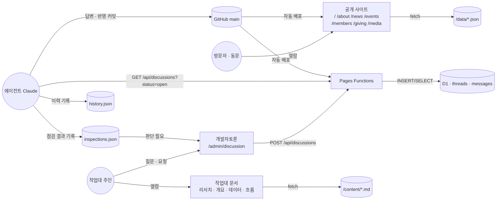
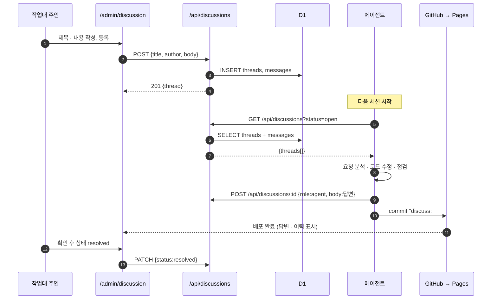
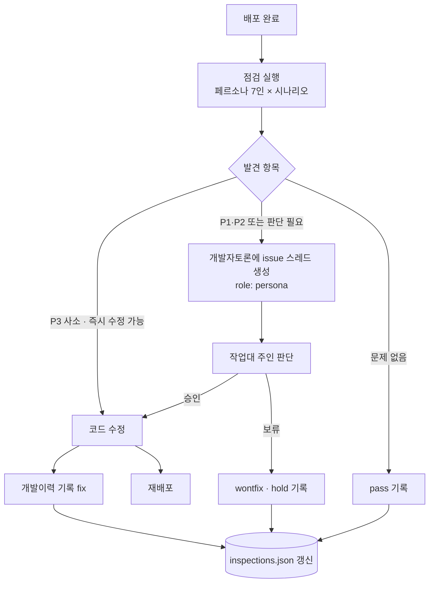
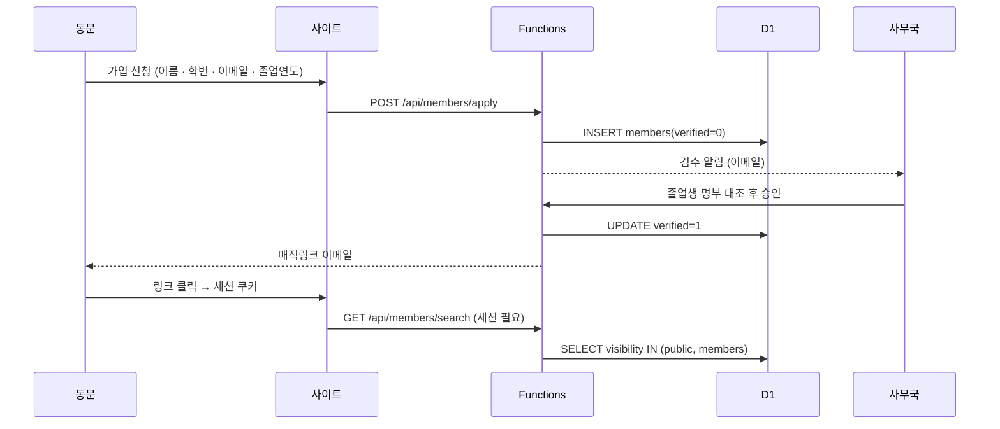
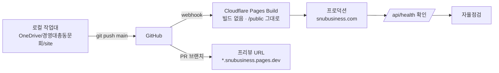

## 1. 전체 데이터 흐름 (Level 0)



## 2. 개발자토론 — 질의 → 반영 시퀀스



## 3. 자율점검 — 페르소나 순환



## 4. 콘텐츠 흐름 (P1 → P2)

```mermaid
flowchart LR
  subgraph P1 · 파일
    E1[에이전트가 JSON 편집] --> C1[git commit] --> B1[Pages 배포] --> S1[사이트 fetch /data/*.json]
  end
  subgraph P2 · CMS
    E2[사무국이 작업대 편집 화면 입력] --> A2[POST /api/posts] --> D2[(D1 posts · events)] --> S2[사이트 fetch /api/posts]
  end
  P1 -. 이관 스크립트 .-> P2
```

## 5. 회원 인증 흐름 (P3 설계안)



## 6. 배포 파이프라인



## 7. 데이터 보관 · 백업
| 데이터 | 위치 | 백업 | 보관 |
|---|---|---|---|
| 소스 · JSON · MD | GitHub | git 이력 자체 | 영구 |
| D1 (토론, P2~ 콘텐츠) | Cloudflare | Time Travel(30일) + 주기 export(P6) | 영구 |
| 회원 개인정보 (P3) | D1 (암호화 필드) | 주기 export → 암호화 보관 | 탈퇴 후 즉시 삭제 |
| 사진 | Cloudflare R2 또는 Images (P2) | 원본 별도 보관 | 영구 |
