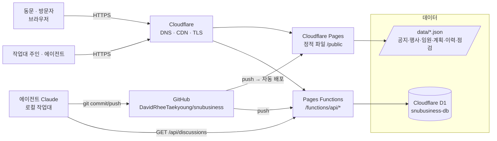

## 1. 마스터 개발계획 (Master Development Plan)

> **이 문서가 최상위 기준이다.** 모든 개발 세션은 이 계획을 먼저 읽고 시작하며, 계획 변경은 개발자토론을 거쳐 이 문서와 개발이력에 동시에 기록한다.

### 1.1 목표
서울대학교 경영대학 총동문회의 공식 홈페이지 **snubusiness.com**을 "세계 수준 비즈니스스쿨 동문회의 디지털 사랑방"으로 구축한다. 우아하고 고급스러운 디자인, 모바일 우선, 사무국이 스스로 운영할 수 있는 구조.

### 1.2 이해관계자
| 역할 | 누구 | 관심사 |
|---|---|---|
| 발주자 · 운영 | 총동문회 (사무국) | 공지·행사·회비·경조사 운영, 동문 참여 확대 |
| 개발 지휘 | 이태경 (작업대 주인) | 방향 결정, 토론을 통한 지시 |
| 개발 실행 | 에이전트 Claude (작업대) | 계획 준수, 자율 점검, 이력 기록 |
| 사용자 | 동문 (60~00학번, MBA/EMBA/AMP) · 재학생 · 모교 | 소식, 네트워킹, 장학, 기부 |

### 1.3 단계별 계획
| 단계 | 목표 | 산출물 | 완료 기준 |
|---|---|---|---|
| **P0** | 리서치 · IA · 디자인 시스템 | 리서치 페이퍼, IA, main.css | 작업대 리서치 페이지 게시 ✔ |
| **P1** | 공개 사이트 v1 + 작업대 + 배포 | 7개 공개 페이지, 7개 작업대 페이지, Pages 배포, D1 토론 | snubusiness.com 접속, 토론 글 저장 |
| **P2** | 실데이터 · CMS | 공지/행사/임원 D1 이관, 작업대 편집 UI | 사무국이 직접 공지 등록 |
| **P3** | 회원 시스템 | 인증, 마이페이지, 동문 찾기, 기별 페이지 | 동문 100명 가입 테스트 |
| **P4** | 신청 · 결제 | 행사 신청, 회비/기부 결제, 영수증 | 실결제 1건 |
| **P5** | 커뮤니티 | 멘토링, 동문 기업 등재, 뉴스레터, 검색 | 멘토링 1기 운영 |
| **P6** | 운영 안정화 | 접근성, 성능, 백업, 매뉴얼 | Lighthouse 90+, 운영 매뉴얼 |

### 1.4 원칙
1. **정적 우선, 점진적 동적화** — 빌드 도구 없는 HTML/CSS/JS. 필요한 곳만 Functions + D1.
2. **데이터는 파일 → DB로** — 초기엔 `/data/*.json`, 검증 후 D1 테이블로 이관. 스키마는 데이터정의 문서가 단일 출처.
3. **모든 변경은 이력으로** — 개발이력에 시각·종류·내용·파일을 남긴다. 세션 시작 시 마지막 10건을 읽는다.
4. **토론이 지시다** — 작업대 주인의 요청은 개발자토론 스레드로 들어오고, 에이전트는 답변·반영·이력 링크를 스레드에 남긴다.
5. **자율점검은 매 배포 후** — 페르소나 7인으로 시나리오를 돌리고, 사소한 문제는 즉시 수정, 판단이 필요한 문제는 토론으로.
6. **품격** — 네이비·골드·아이보리, 세리프 헤드라인, 여백. 화려함보다 절제.

---

## 2. 시스템 아키텍처



### 2.1 구성요소
| 구성요소 | 역할 | 비고 |
|---|---|---|
| Cloudflare Pages | 정적 호스팅, 자동 배포 | 브랜치 `main` → 프로덕션 |
| Pages Functions | `/api/*` 서버리스 API | 파일 기반 라우팅 `functions/api/...` |
| D1 | 토론 스레드·메시지, (P2~) 공지·행사·회원 | 바인딩 이름 `DB` |
| GitHub | 소스·이력의 단일 저장소 | 에이전트의 모든 변경은 커밋으로 |
| /data/*.json | P1 콘텐츠 데이터 | P2에서 D1로 이관 |
| /content/*.md | 작업대 문서(리서치·개요·데이터·흐름) | marked + mermaid로 렌더 |

---

## 3. 전체 페이지 구성도 (Sitemap)

```mermaid
flowchart TB
  H[/ 홈/]
  H --> AB[/about/ 동문회 소개]
  AB --> AB1[#greeting 회장 인사말]
  AB --> AB2[#mission 비전 · 사업]
  AB --> AB3[#history 연혁]
  AB --> AB4[#bylaws 회칙]
  AB --> AB5[#officers 임원 · 조직]
  AB --> AB6[#office 사무국]
  H --> NW[/news/ 소식]
  NW --> NW1[#notice 공지사항]
  NW --> NW2[#news 동문회 소식]
  NW --> NW3[#family 동문 경조사]
  NW --> NW4[#press 언론 속 동문]
  H --> EV[/events/ 행사]
  EV --> EV1[#calendar 행사 일정]
  EV --> EV2[#assembly 정기총회]
  EV --> EV3[#homecoming 홈커밍데이]
  EV --> EV4[#clubs 산행 · 골프 · 바둑]
  H --> MB[/members/ 동문]
  MB --> MB1[#directory 동문 찾기 🔒]
  MB --> MB2[#classes 기별 동문회]
  MB --> MB3[#companies 동문 기업]
  MB --> MB4[#stories 동문 이야기]
  MB --> MB5[#mentoring 멘토링]
  H --> GV[/giving/ 장학 · 기부]
  GV --> GV1[#scholarship 장학사업]
  GV --> GV2[#dues 회비 납부]
  GV --> GV3[#donate 기부 안내]
  GV --> GV4[#honor 기부자 예우]
  GV --> GV5[#report 재정 보고]
  H --> MD[/media/ 자료실]
  MD --> MD1[#newsletter 동문회보]
  MD --> MD2[#gallery 갤러리]
  MD --> MD3[#directory 동문 명부]
  MD --> MD4[#forms 서식]
  H --> LG[/login/ 로그인 · P3]
  H --> LEG[/privacy/ · /terms/ · /email-policy/]
```

```mermaid
flowchart TB
  W[/admin/ 작업대 대시보드]
  W --> W1[/admin/research/ 1. 리서치]
  W --> W2[/admin/overview/ 2. 개발개요 · 마스터플랜]
  W --> W3[/admin/data/ 3. 데이터정의]
  W --> W4[/admin/dataflow/ 4. 데이터흐름도]
  W --> W5[/admin/discussion/ 5. 개발자토론 ⇄ D1]
  W --> W6[/admin/inspection/ 6. 자율점검]
  W --> W7[/admin/history/ 7. 개발이력]
  W5 -.->|문제 제기| W6
  W6 -.->|판단 필요 → 토론| W5
  W6 -.->|즉시 수정 → 기록| W7
  W5 -.->|반영 → 기록| W7
  W7 -.->|계획 변경 반영| W2
```

---

## 4. 화면 설계 원칙 (공개 사이트)
| 요소 | 규칙 |
|---|---|
| 헤더 | 상단 유틸바(관련 사이트 · 로그인 · Workbench) + 스티키 메인 내비 6개 + 골드 CTA "동문회비 납부" |
| 히어로 | 네이비 그라데이션, 인장 워터마크, 카피 + 2개 CTA + 4개 통계 |
| 섹션 리듬 | 아이보리 → 화이트 → 아이보리 → 네이비(기부) → 화이트 순으로 교차 |
| 카드 | 1px 라인, 호버 시 골드 보더 + 살짝 상승 |
| 인테리어 페이지 | 페이지 히어로(브레드크럼·영문 아이브로·제목·리드) + 스티키 서브내비(앵커) + 섹션 |
| 타이포 | 제목 Noto Serif KR / 영문 장식 Cormorant Garamond / 본문 Noto Sans KR |
| 색 | 네이비 #0B1F3A · 골드 #B8952E/#C9A961 · 아이보리 #F7F4EE · 잉크 #1A1A1A |

## 5. 작업대(관리자) 운영 규칙
1. 세션 시작: `개발이력` 최근 10건 → `개발자토론` 열린 스레드 → `자율점검` 미해결 항목 순으로 읽는다.
2. 작업: 마스터플랜의 현재 단계 범위 안에서만 진행. 범위 밖 요청은 토론에 "범위 조정 제안"으로 남긴다.
3. 세션 종료: 개발이력에 변경 요약과 다음 할 일을 남기고 커밋·푸시한다.
4. 배포 후: 자율점검 시나리오를 돌리고 결과를 기록한다.

## 6. 현재 상태 · 다음 할 일
- **완료(P0)**: 리서치, IA, 디자인 시스템
- **진행(P1)**: 공개 7페이지, 작업대 7페이지, GitHub 저장소, Cloudflare Pages 배포, snubusiness.com 연결, D1 바인딩
- **다음(P2 진입 조건)**: 임원 명단·회칙 전문·실제 공지 확보 (작업대 주인 제공), 사진 자산 확보
